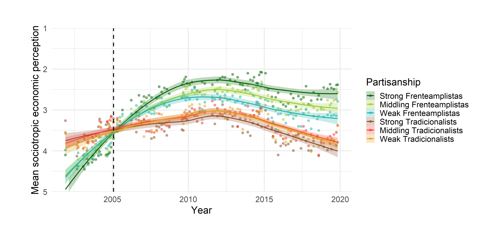
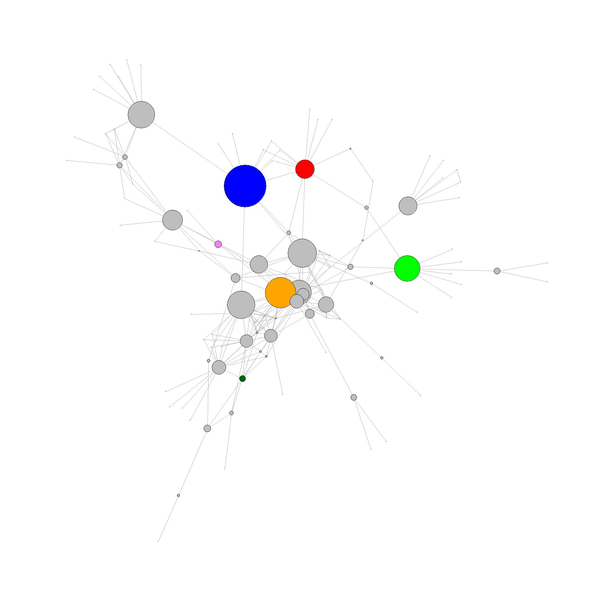

## Artículos arbitrados

+ Opertti, M. (2020). Stoic partisans. The political conditioning of economic perceptions in Uruguay. Revista Latinoamericana de Opinión Pública, 9(1), 67-88.

  **Abstract:** The power of the electorate to reward or to punish governments for their performance is one of the pillars of conventional democratic theory, with economic perceptions as one of the most important issues for the public opinion. However, there is an ongoing debate over whether causality also flows the other way. This article aims to test whether partisanship shapes economic perceptions while extending the argument to the context of a developing economy. Furthermore, it analyses the impact of not only the direction of partisanship but also it´s strength, an overlooked feature in the partisan bias literature. The analysis, which aggregates an unusually rich data set of Uruguayans´ economic evaluations for the 2001-2019 period, presents strong evidence for the argument that both the direction and strength of partisanship produce great bias in economic judgments even in a developing economy context where citizens are more vulnerable to economic shocks. These findings suggest a rather unsettling scenario for electoral accountability in a significant part of the Uruguayan electorate.
 
 
*Percepciones económicas sociotrópicas en Uruguay según dirección y fortaleza de las identificaciones partidarias*

## Capítulos arbitrados en libros

+ Big Business and Bureaucratic-Authoritarianism in Uruguay: a network based story of policy permeation for self-preservation. Con Juan A. Bogliaccini y Juan Geymonat

**Abstract:** Understanding the relations of business and politics is of profound importance. This chapter examines corporate interlocks among business elites in Uruguay during the bureaucratic authoritarian period and business-related connections among government officials. First, we describe how business strategy for influencing policy outcomes evolved from the ISI to the Bureaucratic-Authoritarian period. We show how it moved from institutionalized corporate participation in decision-making to direct participation of businesspersons in government after the shift towards technocratic management in government beginning in 1967 and continued after the military coup in 1973. Second, we characterize the structure of big business circa 1979-1984 using network analysis. We explore its’ connections with the rest of the economy, identifying the most relevant business communities and how they were linked to each other. The chapter concludes with the identification of the most influential business-groups by different network related measures and in terms of its’ connections to government during the military period. For the most important business-groups, we provide a case study of how they permeated the military government´s liberalization process in order to cushion its’ impact on their wealth and industries.

 
*Posición y betweenness centrality  de los grupos empresariales con vínculos con gobierno militar en Uruguay.*
